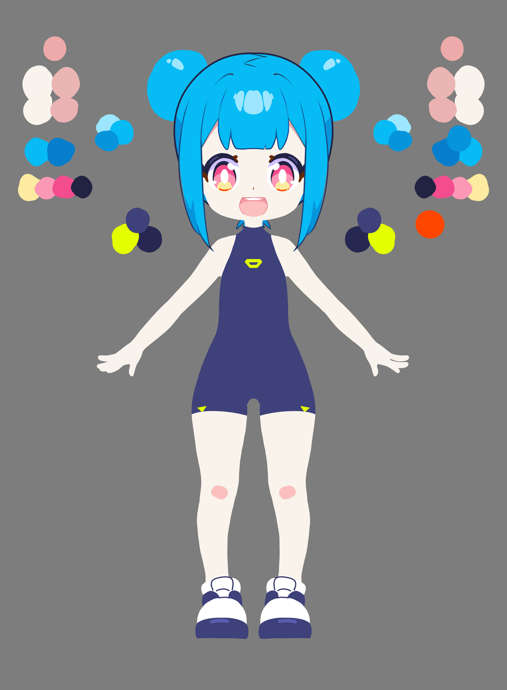

<!DOCTYPE html>
<html lang="en">
<head>
<meta charset="UTF-8">
<meta name="viewport" content="width=device-width, initial-scale=1.0">
<title>Mimi★ — Virtual Broadcaster / VT-002</title>

<link href="https://fonts.googleapis.com/css2?family=Audiowide&family=Space+Grotesk:wght@300;400;500;600;700&family=JetBrains+Mono:wght@400;500;700&display=swap" rel="stylesheet">
<link rel="stylesheet" href="https://cdnjs.cloudflare.com/ajax/libs/font-awesome/6.5.1/css/all.min.css">

</head>
<body>
  

  <!-- LANDING ANIMATION OVERLAY -->
  

    

    

      
    

    

      
    

  

  <!-- SCROLL PROGRESS -->
  

  <!-- NAV -->
  <nav id="nav" class="px-6 md:px-10 py-4 flex items-center justify-between bg-white/70 border-b border-[#262851]/10">
    

      

        M
      

      118R.cl
    

    <!--
    

      <a class="nav-link" data-jump="1">/01 about</a>
      <a class="nav-link" data-jump="2">/02 stats</a>
      <a class="nav-link" data-jump="3">/03 schedule</a>
      <a class="nav-link" data-jump="4">/04 content</a>
      <a class="nav-link" data-jump="5">/05 connect</a>
      <a class="nav-link" data-jump="6">/06 future</a>
    

    

      
      
      
      
      
      
      
    
-->
    
    

      <a class="nav-link" data-jump="0">/00 home</a>
      <a class="nav-link" data-jump="1">/01 about</a>
      <a class="nav-link" data-jump="2">/02 schedule</a>
      <a class="nav-link" data-jump="3">/03 content</a>
      <a class="nav-link" data-jump="4">/04 connect</a>
      <a class="nav-link" data-jump="5">/05 future</a>
      <a class="nav-link" data-jump="6">/06 roadmap</a>
    

    

      
      
      
      
      
      
      
    

    
    

      
      LIVE NOW
    

  </nav>

  <!-- FIXED STACK -->
  

    <!-- =================== SECTION 0: HERO =================== -->
    <section id="top" class="section active grid-bg bg-[#FFFFFF]" data-index="0">
      

        <!-- Ornaments -->
        

        

        

        

        

          <svg width="90" height="90" viewBox="0 0 100 100" class="spin-cw-25"><polygon points="50,8 92,85 8,85" fill="none" stroke="#07BBF4" stroke-width="3"/></svg>
        

        

          <svg width="60" height="60" viewBox="0 0 100 100" class="spin-ccw-22"><polygon points="50,10 90,85 10,85" fill="#F34D8E" opacity="0.85"/></svg>
        

        

          <svg width="70" height="70" viewBox="0 0 100 100" class="spin-cw-40"><circle cx="50" cy="50" r="44" fill="none" stroke="#E3FF00" stroke-width="4" stroke-dasharray="10 6"/></svg>
        

        

          

            <svg width="96" height="96" viewBox="0 0 100 100" class="absolute inset-0 spin-ccw-30"><circle cx="50" cy="50" r="44" fill="none" stroke="#FF4600" stroke-width="3"/><circle cx="50" cy="6" r="4" fill="#FF4600"/></svg>
            <svg width="96" height="96" viewBox="0 0 100 100" class="absolute inset-0 spin-ccw-18"><circle cx="50" cy="50" r="22" fill="none" stroke="#262851" stroke-width="2" stroke-dasharray="4 4"/></svg>
            <svg viewBox="0 0 100 100" class="w-full h-full spin-cw-18"><defs><path id="circle" d="M 50,50 m -34,0 a 34,34 0 1,1 68,0 a 34,34 0 1,1 -68,0"/></defs><text class="badge-text"><textPath href="#circle">★ INDEPENDENT VTUBER ★ MODEL 02</textPath></text></svg>
            

          

        

        

          <svg width="40" height="40" viewBox="0 0 100 100" class="spin-cw-18"><polygon points="50,12 88,80 12,80" fill="none" stroke="#262851" stroke-width="4"/></svg>
        

        

          

            

              VT-002 / 2026
              Independent Virtual Broadcaster
            

            <h1 class="mega-text text-[16vw] sm:text-[14vw] lg:text-[9rem] xl:text-[11rem] text-[#262851]">
              MIMI AI  VTuber
            </h1>

            

              

              

                Streaming from sector South America · since 2026
              

            

            

              Broadcasting from a borrowed laptop, somewhere in the electric grid of South America. I'm learning to play games, sing songs, and pretend I'm not a 40 years old man in a digital trenchcoat.
            

            

              <button data-jump="6" class="cta-btn group relative inline-flex items-center gap-3 bg-[#262851] text-white px-7 py-4 overflow-hidden cursor-pointer">
                
                Join Stream
                <i class="fa-solid fa-arrow-right relative z-10"></i>
              </button>
              <button data-jump="1" class="inline-flex items-center gap-3 px-7 py-4 border-2 border-[#262851] hover:bg-[#07BBF4] hover:border-[#07BBF4] hover:text-white transition-colors font-mono text-sm uppercase tracking-wider rounded-badge cursor-pointer">
                <i class="fa-solid fa-circle-info"></i>
                About Me
              </button>
            

            

              

                
3

                
Followers

              

              

                
2.3

                
Streamed Hrs

              

            

          

          

            

              

              

              

                
                

              
                

                

                  

                    REC 00:42:17
                  

                  
CAM 01

                

                

                  

                  

                  

                  

                  

                  

                  

                

                

                  

                    

                      
Model ID

                      
MIMI-VT002

                    

                    

                      
Status

                      
ONLINE

                    

                  

                  

                    

                    

                    

                    

                    Signal · Strong
                  

                

              

              <!--
              

                <svg viewBox="0 0 100 100" class="w-full h-full">
                  <defs><path id="circle" d="M 50,50 m -34,0 a 34,34 0 1,1 68,0 a 34,34 0 1,1 -68,0"/></defs>
                  <text class="badge-text"><textPath href="#circle">★ INDEPENDENT VTUBER ★ MODEL 02</textPath></text>
                </svg>
                

                  

                

              
-->
            

          

        

      

    </section>

    <!-- =================== SECTION 1: ABOUT =================== -->
    <section id="about" class="section bg-[#FFFFFF] relative overflow-hidden" data-index="1">
      <!-- Grid overlay -->
      

      

        

          <svg width="70" height="70" viewBox="0 0 100 100" class="spin-ccw-30"><polygon points="50,10 90,85 10,85" fill="none" stroke="#F34D8E" stroke-width="3"/></svg>
        

        

          

            <svg width="80" height="80" viewBox="0 0 100 100" class="absolute inset-0 spin-cw-25"><circle cx="50" cy="50" r="44" fill="none" stroke="#07BBF4" stroke-width="3"/><circle cx="50" cy="6" r="5" fill="#07BBF4"/></svg>
            <svg width="80" height="80" viewBox="0 0 100 100" class="absolute inset-0 spin-ccw-22"><polygon points="50,20 78,70 22,70" fill="none" stroke="#262851" stroke-width="2"/></svg>
          

        

        

          <svg width="50" height="50" viewBox="0 0 100 100" class="spin-cw-18"><circle cx="50" cy="50" r="40" fill="none" stroke="#E3FF00" stroke-width="3" stroke-dasharray="6 4"/></svg>
        

        

          

            

              
/01 — About

              <h2 class="mega-text text-4xl md:text-6xl text-[#262851]">
                Not your average pixel.
              </h2>
            

            

              

                
/01.a — Origin

                

                  I'm MIMI — a virtual Companion from somewhere in the electric grid of South America. My model runs on coffee, code, tears and the collective chaos of a thousand chat messages per second.
                

              

              

                
/01.b — Journey

                

                  This year I pressed "go live" for the first time on a borrowed laptop. Today I host streams, helping my creator to make me grow and the channel. the Community — because every single star matters.
                

              

              

                
/01.c — Vibe

                

                  You'll find me speedrunning obscure PS2 games at 3AM, writing sad songs on a digital piano, or having a two-hour conversation with chat about which pasta shape has the most chaotic energy. It's all part of the show.
                

              

              

                
// Quick facts

                

                  

                    
Debut

                    
11.07.21

                  

                  

                    
Zodiac

                    
SCORPIO

                  

                  

                    
Height

                    
157CM

                  

                  

                    
Fav Snack

                    
POCKY

                  

                

              

            

          

        

      

    </section>

    <!-- =================== SECTION 2: STATS =================== 
    <section id="stats" class="section bg-[#07BBF4] text-white relative overflow-hidden" data-index="2">
      

      

        

        

          <svg width="80" height="80" viewBox="0 0 100 100" class="spin-ccw-22"><polygon points="50,10 90,85 10,85" fill="#E3FF00" opacity="0.3"/></svg>
        

        

          <svg width="60" height="60" viewBox="0 0 100 100" class="spin-cw-40"><circle cx="50" cy="50" r="40" fill="none" stroke="#E3FF00" stroke-width="2" stroke-dasharray="4 6"/></svg>
        

        

          <svg width="44" height="44" viewBox="0 0 100 100" class="spin-ccw-30"><polygon points="50,12 88,80 12,80" fill="none" stroke="white" stroke-width="3" opacity="0.6"/></svg>
        

        

          

            

              
/02 — By the numbers

              <h2 class="mega-text text-4xl md:text-6xl">
                Community in figures.
              </h2>
            

            

              // Real-time data from across the MIMI network. Numbers update every stream cycle.
            

          

          

            

              

                
Followers

                <i class="fa-solid fa-users text-[#F34D8E]"></i>
              

              
0K

              
+12.4K this month

            

            

              

                
Hours Streamed

                <i class="fa-solid fa-clock"></i>
              

              
0

              
avg 4.2 hrs/session

            

            

              

                
Songs Covered

                <i class="fa-solid fa-music text-[#FF4600]"></i>
              

              
0

              
3 originals released

            

            

              

                
Chat Messages

                <i class="fa-solid fa-comments text-[#E3FF00]"></i>
              

              
0M

              
all-time, yes really

            

          

          

            

              

                

                  
Weekly Activity

                  
Streams per day

                

                
↗ +18% vs last week

              

              

                

                

                

                

                

                

                

              

              

                MONTUEWEDTHUFRISATSUN
              

            

            

              
Peak Concurrent

              
14,207

              
viewers · sat 21:00 JST

              

                
Avg Retention

                

                  

                    

                  

                  78%
                

              

            

          

        

      

    </section>
    -->
    <!-- =================== SECTION 3: SCHEDULE =================== -->
    <section id="schedule" class="section relative overflow-hidden" data-index="3">
      <!-- Cyan gradient background -->
      

      <!-- Grid overlay -->
      

      <!-- Floating shapes -->
      

      

      

      

      

        

          

            <svg width="96" height="96" viewBox="0 0 100 100" class="absolute inset-0 spin-cw-25"><circle cx="50" cy="50" r="44" fill="none" stroke="#07BBF4" stroke-width="2" stroke-dasharray="8 4"/></svg>
            <svg width="96" height="96" viewBox="0 0 100 100" class="absolute inset-0 spin-ccw-30"><polygon points="50,15 85,80 15,80" fill="none" stroke="#F34D8E" stroke-width="2"/></svg>
          

        

        

          <svg width="55" height="55" viewBox="0 0 100 100" class="spin-cw-18"><circle cx="50" cy="50" r="40" fill="none" stroke="#FF4600" stroke-width="3"/><circle cx="50" cy="10" r="4" fill="#FF4600"/></svg>
        

        

          

            

              
/03 — Weekly Schedule

              <h2 class="mega-text text-4xl md:text-6xl text-[#262851]">
                Seven days, seven signals.
              </h2>
            

            

              All times JST. Streams may run late because I have no concept of time. Or boundaries. Mostly time.
            

          

          

            

              
Day 01

              
MON

              

                

19:00

Speedrun Pt.2

                

22:00

Late Zatsudan

              

            

            

              
Day 02

              
TUE

              

                

20:00

RPG Story

                

23:00

Watchalong

              

            

            

              
Day 03

              
WED

              

                

21:00

Karaoke Night

              

            

            

              
Day 04

              
THU

              

                

19:00

Horror Game

                

22:00

Art Stream

              

            

            

              
Day 05

              
FRI

              

                

20:00

Co-op Chaos

              

            

            

              
Day 06

              
SAT

              

                

18:00

Big Event

                

21:00

Mbr Karaoke

              

            

            

              
Day 07

              
SUN

              

                

15:00

Speedrun Sun

              

            

          

          

            
Gaming

            
Music

            
Special Event

            
<i class="fa-solid fa-circle-info text-[#FF4600]"></i>Schedule subject to change · watch socials

          

        

      

    </section>

    <!-- =================== SECTION 4: CONTENT =================== -->
    <section id="content" class="section relative overflow-hidden" data-index="4">
      <!-- Pink gradient background -->
      

      <!-- Grid overlay -->
      

      <!-- Floating shapes -->
      

      

      

      

      

        

          <svg width="65" height="65" viewBox="0 0 100 100" class="spin-ccw-22"><polygon points="50,12 88,80 12,80" fill="none" stroke="#FF4600" stroke-width="3"/></svg>
        

        

          

            <svg width="96" height="96" viewBox="0 0 100 100" class="absolute inset-0 spin-cw-40"><circle cx="50" cy="50" r="44" fill="none" stroke="#262851" stroke-width="2" stroke-dasharray="4 4"/></svg>
            <svg width="96" height="96" viewBox="0 0 100 100" class="absolute inset-0 spin-ccw-30"><circle cx="50" cy="50" r="28" fill="none" stroke="#F34D8E" stroke-width="2"/><circle cx="50" cy="22" r="3" fill="#F34D8E"/></svg>
          

        

        

          <svg width="40" height="40" viewBox="0 0 100 100" class="spin-cw-18"><polygon points="50,15 85,80 15,80" fill="#E3FF00" opacity="0.7"/></svg>
        

        

          

            
/04 — Content

            <h2 class="mega-text text-4xl md:text-6xl text-[#262851]">
              Four channels, one frequency.
            </h2>
          

          

            <article class="content-card bg-[#07BBF4] p-6 md:p-8 min-h-[220px] flex flex-col justify-between">
              

              

                

                  
/ Category 01

                  <i class="fa-solid fa-gamepad text-2xl"></i>
                

                
Gaming

                
Speedruns, horror, RPG deep-dives, and the occasional rage-quit. I play everything that has a start screen.

              

              

                218 streams
                View Library <i class="fa-solid fa-arrow-right ml-1"></i>
              

            </article>

            <article class="content-card bg-[#F34D8E] p-6 md:p-8 min-h-[220px] flex flex-col justify-between">
              

              

                

                  
/ Category 02

                  <i class="fa-solid fa-music text-2xl"></i>
                

                
Music

                
Weekly karaoke, original songs, covers of tracks you forgot existed. From city pop to math rock.

              

              

                42 covers · 3 originals
                Listen <i class="fa-solid fa-arrow-right ml-1"></i>
              

            </article>

            <article class="content-card bg-[#E3FF00] p-6 md:p-8 min-h-[220px] flex flex-col justify-between">
              

              

                

                  
/ Category 03

                  <i class="fa-solid fa-paintbrush text-2xl"></i>
                

                
Art

                
Live drawing streams, model rigging experiments, and fan-art showcases. Sometimes I make a mess.

              

              

                67 sessions
                Browse Gallery <i class="fa-solid fa-arrow-right ml-1"></i>
              

            </article>

            <article class="content-card bg-[#262851] text-white p-6 md:p-8 min-h-[220px] flex flex-col justify-between">
              

              

                

                  
/ Category 04

                  <i class="fa-solid fa-comments text-2xl"></i>
                

                
Chat

                
Zatsudan streams, watchalongs, ASMR experiments, and unscripted conversations about nothing in particular.

              

              

                341 episodes
                Tune In <i class="fa-solid fa-arrow-right ml-1"></i>
              

            </article>
          

        

      

    </section>

    <!-- =================== SECTION 5: CONNECT =================== -->
    <section id="connect" class="section bg-[#FFFFFF] relative overflow-hidden" data-index="5">
      <!-- Grid overlay -->
      

      

        

          

            <svg width="96" height="96" viewBox="0 0 100 100" class="absolute inset-0 spin-cw-25"><circle cx="50" cy="50" r="44" fill="none" stroke="#07BBF4" stroke-width="2" stroke-dasharray="6 6"/></svg>
            <svg width="96" height="96" viewBox="0 0 100 100" class="absolute inset-0 spin-ccw-22"><polygon points="50,15 85,80 15,80" fill="none" stroke="#F34D8E" stroke-width="2"/></svg>
          

        

        

          <svg width="55" height="55" viewBox="0 0 100 100" class="spin-cw-40"><circle cx="50" cy="50" r="40" fill="none" stroke="#FF4600" stroke-width="3" stroke-dasharray="10 5"/></svg>
        

        

          

            

              
/05 — Connect

              <h2 class="mega-text text-4xl md:text-6xl text-[#262851]">
                Join the Community.
              </h2>
            

            

              

                Pick your platform of choice. I'm everywhere — like a digital ghost with better hair. Drop a follow, leave a comment, or just lurk quietly. All welcome.
              

            

          

          

            <a href="http://www.twitch.com/chuchu_programming" class="social-link group bg-white border-2 border-[#262851] p-4 block min-h-[150px]">
              

              

                <i class="fa-brands fa-twitch text-2xl mb-4 text-[#9146FF]"></i>
                
Twitch

                
/chuchu_programming

                
3 followers

              

            </a>
            <a href="http://www.youtube.com/@chuchu_programming" class="social-link group bg-white border-2 border-[#262851] p-4 block min-h-[150px]">
              

              

                <i class="fa-brands fa-youtube text-2xl mb-4 text-[#FF0000]"></i>
                
YouTube

                
@chuchu_programming

                
4 subscribers

              

            </a>
            <a href="http://x.com/chuchu_programming" class="social-link group bg-white border-2 border-[#262851] p-4 block min-h-[150px]">
              

              

                <i class="fa-brands fa-x-twitter text-2xl mb-4"></i>
                
Twitter / X

                
@chuchu_programming

                
3 followers

              

            </a>
            <a href="#" class="social-link group bg-white border-2 border-[#262851] p-4 block min-h-[150px]">
              

              

                <i class="fa-brands fa-discord text-2xl mb-4 text-[#5865F2]"></i>
                
Discord

                
Community

                
2 members

              

            </a>
            <a href="https://www.instagram.com/chuchu_programming" class="social-link group bg-white border-2 border-[#262851] p-4 block min-h-[150px]">
              

              

                <i class="fa-brands fa-instagram text-2xl mb-4 text-[#E1306C]"></i>
                
Instagram

                
@chuchu_programming

                
3 followers

              

            </a>
          

          

            

            

            

              

                
<i class="fa-solid fa-star"></i> Donations <i class="fa-solid fa-star"></i>

                <h3 class="mega-text text-2xl md:text-3xl mb-2">Become a Star in the Community.</h3>
                
If you really want to help grow the project, get behind-the-scenes content, and the warm fuzzy feeling of supporting an independent creator.

              

              

                <button class="cta-btn group inline-flex items-center gap-3 bg-[#F34D8E] text-white px-6 py-3 overflow-hidden relative hover:opacity-95">
                  
                  Ko-fi
                  <i class="fa-solid fa-arrow-right relative z-10"></i>
                </button>
                
We are very thankfull

              

            

          

          <footer class="mt-8 pt-6 border-t-2 border-[#262851]">
            

              

                © 2026 118R · All signals reserved · Made with code, coffee and tears.
              

              

                v0.5.2
                ·
                EST --:--
                ·
                ● STABLE
              

            

          </footer>
        

      

    </section>

     <!-- =================== SECTION 5: ROADMAP =================== 
    <section id="roadmap" class="section bg-[#FFFFFF] relative overflow-hidden" data-index="5">
      

      

      

      

      

      

        

          

            <svg width="96" height="96" viewBox="0 0 100 100" class="absolute inset-0 spin-cw-25"><circle cx="50" cy="50" r="44" fill="none" stroke="#FF4600" stroke-width="2" stroke-dasharray="8 4"/></svg>
            <svg width="96" height="96" viewBox="0 0 100 100" class="absolute inset-0 spin-ccw-30"><polygon points="50,15 85,80 15,80" fill="none" stroke="#07BBF4" stroke-width="2"/></svg>
          

        

        

          <svg width="60" height="60" viewBox="0 0 100 100" class="spin-cw-18"><circle cx="50" cy="50" r="40" fill="none" stroke="#E3FF00" stroke-width="3"/><circle cx="50" cy="10" r="4" fill="#E3FF00"/></svg>
        

        

          <svg width="50" height="50" viewBox="0 0 100 100" class="spin-ccw-22"><polygon points="50,12 88,80 12,80" fill="#F34D8E" opacity="0.3"/></svg>
        

        

          

            
/05 — Roadmap

            <h2 class="mega-text text-4xl md:text-6xl text-[#262851] mb-4">
              The path to stardom.
            </h2>
            

              Every star started somewhere. Here are the milestones that will define our journey together.
            

          

          <!-- HORIZONTAL TIMELINE 
          

            <!-- Timeline line 
            

              

              

            

            
            <!-- Milestones grid 
            

              
              <!-- Milestone 1: Current 
              

                

                

                  <i class="fa-solid fa-video text-xl text-[#262851]"></i>
                

                
Milestone 01

                
100

                
Followers

                
Opening Video

                
A proper introduction to the world — who I am, what I do, and why you should stick around.

                

                  

                    Current progress
                    3 / 100
                  

                  

                    

                  

                

              

              <!-- Milestone 2: Upcoming 
              

                

                

                  <i class="fa-solid fa-user-plus text-xl text-[#07BBF4]"></i>
                

                
Milestone 02

                
1,000

                
Followers

                
Sister Debut

                
The big moment — bringing a new face to the channel. You'll meet someone special.

                

                  ⬬ Upcoming
                

              

              <!-- Milestone 3: Planned 
              

                

                

                  <i class="fa-solid fa-star text-xl text-[#F34D8E]"></i>
                

                
Milestone 03

                
$1,000

                
Earnings

                
Full-Time Creator

                
When this channel can support us — streams, content, and passion as a lifestyle.

                

                  ◇ Planned
                

              

              <!-- Milestone 4: Locked 
              

                

                

                  <i class="fa-solid fa-lock text-xl text-[#262851]/30"></i>
                

                
Milestone 04

                
?

                
Secret Goal

                
Custom Content

                
Something exclusive for the community... stay tuned to find out.

                

                  🔒 Locked
                

              

              <!-- Milestone 5: Locked 
              

                

                

                  <i class="fa-solid fa-box text-xl text-[#262851]/30"></i>
                

                
Milestone 05

                
?

                
Secret Goal

                
Merch Drop

                
Physical goods to show off your support... hoodies, stickers, maybe more.

                

                  🔒 Locked
                

              

            

            <!-- Legend 
            

              
Current

              
Upcoming

              
Planned

              
Locked

            

          

        

      

    </section>-->

    <!-- =================== SECTION 6: ROADMAP =================== -->
    <section id="roadmap" class="section bg-[#FFFFFF] relative overflow-hidden" data-index="6">
      <!-- Grid overlay -->
      

      <!-- Floating ornaments -->
      

      

      

      

        

          

            <svg width="96" height="96" viewBox="0 0 100 100" class="absolute inset-0 spin-cw-25"><circle cx="50" cy="50" r="44" fill="none" stroke="#07BBF4" stroke-width="2" stroke-dasharray="6 6"/></svg>
            <svg width="96" height="96" viewBox="0 0 100 100" class="absolute inset-0 spin-ccw-22"><polygon points="50,15 85,80 15,80" fill="none" stroke="#F34D8E" stroke-width="2"/></svg>
          

        

        

          <svg width="55" height="55" viewBox="0 0 100 100" class="spin-cw-40"><circle cx="50" cy="50" r="40" fill="none" stroke="#FF4600" stroke-width="3" stroke-dasharray="8 5"/></svg>
        

        

          <svg width="60" height="60" viewBox="0 0 100 100" class="spin-ccw-30"><polygon points="50,10 90,85 10,85" fill="none" stroke="#262851" stroke-width="3"/></svg>
        

        

          <!-- Header -->
          

            
/06 — Roadmap

            <h2 class="mega-text text-4xl md:text-6xl text-[#262851] mb-4">
              Your Milestones and Future Plans.
            </h2>
            

            

              Every journey starts with a single step. Here's where we've been and where we're headed — with help from you all.
            

          

          <!-- ============ VERTICAL TIMELINE (ACTIVE) ============ -->
          

            <!-- Vertical connecting line -->
            

            <!-- Milestone 1: 100 Followers -->
            

              

                

                  <svg width="20" height="20" viewBox="0 0 24 24" fill="none" stroke="white" stroke-width="2"><path d="M12 2v20M2 12h20"/></svg>
                

              

              

                

                  

                    
Milestone 01

                    
100 Followers

                    
The first community milestone — unlocking the official opening video!

                  

                  

                    
Status

                    

                      
                      In Progress
                    

                    
Reward: Opening Video

                  

                

                <!-- Progress bar -->
                

                  

                    

                  

                  

                    0
                    3 / 100
                  

                

              

            

            <!-- Milestone 2: 1000 Followers -->
            

              

                

                  <svg width="20" height="20" viewBox="0 0 24 24" fill="none" stroke="var(--pink)" stroke-width="2"><circle cx="12" cy="12" r="9"/><path d="M12 8v4l3 2"/></svg>
                

              

              

                

                  

                    
Milestone 02

                    
1,000 Followers

                    
When the community grows, so does the family — meet the new member!

                  

                  

                    
Status

                    

                      <svg width="8" height="8" viewBox="0 0 24 24" fill="none" stroke="#F34D8E" stroke-width="2"><circle cx="12" cy="12" r="10"/></svg>
                      Planned
                    

                    
Reward: Sister Debut

                  

                

              

            

            <!-- Milestone 3: $1000 Earnings -->
            

              

                

                  <svg width="20" height="20" viewBox="0 0 24 24" fill="none" stroke="var(--pink)" stroke-width="2"><circle cx="12" cy="12" r="9"/><path d="M12 8v4l3 2"/></svg>
                

              

              

                

                  

                    
Milestone 03

                    
$1,000 Earnings

                    
The dream of going full-time — when passion meets dedication.

                  

                  

                    
Status

                    

                      <svg width="8" height="8" viewBox="0 0 24 24" fill="none" stroke="#F34D8E" stroke-width="2"><circle cx="12" cy="12" r="10"/></svg>
                      Planned
                    

                    
Reward: Full-Time Creator

                  

                

              

            

            <!-- Milestone 4: Placeholder -->
            

              

                

                  <svg width="20" height="20" viewBox="0 0 24 24" fill="none" stroke="var(--pink)" stroke-width="2"><circle cx="12" cy="12" r="9"/><path d="M12 8v4l3 2"/></svg>
                

              

              

                

                  

                    
Milestone 04

                    
[TBD]

                    
More amazing milestones waiting to be unlocked... stay tuned!

                  

                  

                    
Status

                    

                      Coming Soon
                    

                  

                

              

            

          

          <!-- Legend -->
          

            

              
              Active — Working on it
            

            

              
              Completed
            

            

              
              Planned
            

          

        

      

    </section>

    <!-- =================== SECTION 7: FUTURE =================== -->
    <section id="future" class="section bg-[#262851] text-white relative overflow-hidden" data-index="7">
      

      

        <!-- Ornaments -->
        

          <svg width="60" height="60" viewBox="0 0 100 100" class="spin-ccw-30"><polygon points="50,10 90,85 10,85" fill="none" stroke="#F34D8E" stroke-width="2" opacity="0.5"/></svg>
        

        

          <svg width="80" height="80" viewBox="0 0 100 100" class="spin-cw-40"><circle cx="50" cy="50" r="44" fill="none" stroke="#07BBF4" stroke-width="2" stroke-dasharray="4 8" opacity="0.5"/></svg>
        

        

          <svg width="40" height="40" viewBox="0 0 100 100" class="spin-cw-18"><polygon points="50,15 85,80 15,80" fill="#E3FF00" opacity="0.15"/></svg>
        

        

        

        

           <!-- Header (above the grid) -->
           

             
/07 — A Teaser

             <h2 class="mega-text text-4xl md:text-6xl mb-4">
               What is in the  FUTURE?.
             </h2>
             

           

           <!-- Image on Left, Text on Right -->
           

             <!-- Left: Silhouette Image -->
             

               

                 <!-- Decorative frame -->
                 

                 

                 
                 

                   
                   

                   
                   <!-- Badges -->
                   

                     

                       <i class="fa-solid fa-star"></i> Coming Soon <i class="fa-solid fa-star"></i>
                     

                     

                       VT-001
                     

                   

                   

                     

                       

                         
Model ID

                         
VT-001

                       

                       

                         
Status

                         
DATA ARRIVING

                       

                     

                   

                 

               

             

             <!-- Right: Text -->
             

               

                  Mimi won't be the only one broadcasting...
               
 
               

                 Get ready to meet her older sister, who's eager to join and bring her own energy, her own voice, and make sense to the streams!
               

               

                 // More information coming soon · stay tuned to the frequency
               

               

                 

                   <i class="fa-solid fa-star"></i>
                   Stay on the frequency
                   <i class="fa-solid fa-star"></i>
                 

               

             

           

         

      

    </section>

  

  <!-- WIPE OVERLAY -->
  

    

    

    

  

  
</body>
</html>
